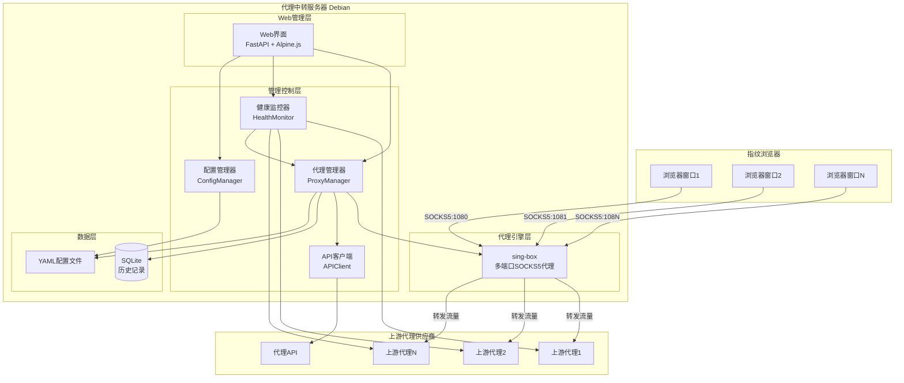
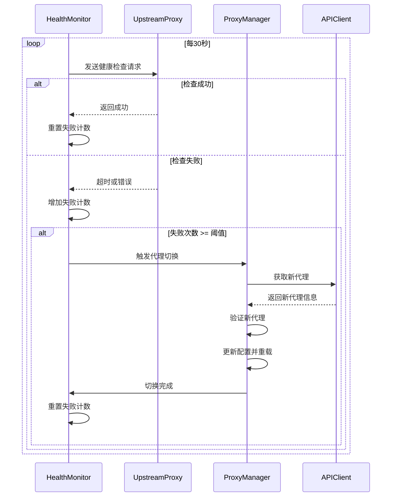

# 设计文档

## 概述

代理中转系统是一个基于sing-box的SOCKS5代理中转服务，提供自动化的上游代理健康监控和切换功能。系统采用模块化设计，包括代理引擎层、管理控制层、监控层和Web界面层。

### 设计目标

1. **简单性**: 从最简单的实现开始，使用成熟的开源组件
2. **可靠性**: 确保代理切换过程不中断现有连接
3. **可扩展性**: 支持未来添加更多功能和代理协议
4. **易用性**: 提供直观的Web界面和命令行工具

### 技术选型

- **代理引擎**: sing-box (轻量、高性能、配置简单)
- **后端语言**: Python 3.11+ (快速开发、丰富的库支持)
- **Web框架**: FastAPI (现代、高性能、自动API文档)
- **前端**: HTML + Alpine.js + Tailwind CSS (简单、无需构建步骤)
- **数据存储**: SQLite (轻量、无需额外服务)
- **配置格式**: YAML (人类可读、易于编辑)
- **进程管理**: systemd (Debian标准)

## 架构

### 系统架构图



### 组件说明

1. **sing-box代理引擎**: 提供多端口SOCKS5代理服务，每个端口对应一个上游代理
2. **ProxyManager**: 管理代理配置，处理代理切换逻辑
3. **HealthMonitor**: 定期检查上游代理健康状态，触发切换
4. **APIClient**: 与代理供应商API交互，获取新的代理信息
5. **ConfigManager**: 管理系统配置文件的读写
6. **Web界面**: 提供可视化管理界面
7. **SQLite数据库**: 存储代理切换历史、监控日志等
8. **YAML配置**: 存储系统配置和代理配置

## 组件和接口

### 1. 代理引擎层 (sing-box)

**职责**: 提供SOCKS5代理服务，转发流量到上游代理

**配置结构**:
```json
{
  "inbounds": [
    {
      "type": "socks",
      "tag": "socks-1080",
      "listen": "0.0.0.0",
      "listen_port": 1080
    }
  ],
  "outbounds": [
    {
      "type": "socks",
      "tag": "upstream-1080",
      "server": "upstream.proxy.com",
      "server_port": 10000,
      "username": "user",
      "password": "pass"
    }
  ],
  "route": {
    "rules": [
      {
        "inbound": ["socks-1080"],
        "outbound": "upstream-1080"
      }
    ]
  }
}
```

**接口**:
- 配置文件路径: `/etc/proxy-relay/sing-box.json`
- 重载配置: 发送 SIGHUP 信号或重启服务
- 日志输出: `/var/log/proxy-relay/sing-box.log`

### 2. 配置管理器 (ConfigManager)

**职责**: 管理系统配置和代理配置的读写

**配置文件结构** (`/etc/proxy-relay/config.yaml`):
```yaml
system:
  web_port: 8080
  web_auth:
    enabled: true
    username: admin
    password_hash: <bcrypt_hash>
  log_level: INFO
  log_file: /var/log/proxy-relay/app.log
  database: /var/lib/proxy-relay/data.db

monitoring:
  check_interval: 30  # 秒
  failure_threshold: 3  # 连续失败次数
  check_timeout: 10  # 秒
  check_url: "http://www.google.com"  # 健康检查URL

# 支持多个API提供商配置
api_providers:
  - id: "provider1"
    name: "91HTTP"
    enabled: true
    endpoint: "https://api.91http.com/v1/get-ip"
    method: "GET"  # GET 或 POST
    params:
      trade_no: "A461584673943"
      secret: "jg3p8xBYPpM7J6sy"
      num: "1"
      format: "json"
      protocol: "socks5"
    timeout: 10
    retry_attempts: 3
    retry_backoff: 2
    response_format:
      type: "91http"  # 预定义的响应格式类型
      success_code: 0
      data_path: "data.proxy_list"
      ip_field: "ip"
      port_field: "port"
      username_field: null  # 如果API不返回用户名
      password_field: null  # 如果API不返回密码
  
  - id: "provider2"
    name: "备用提供商"
    enabled: false
    endpoint: "https://api.example.com/proxy"
    method: "POST"
    headers:
      Authorization: "Bearer your_token"
    body:
      type: "socks5"
      count: 1
    timeout: 10
    retry_attempts: 3
    retry_backoff: 2
    response_format:
      type: "custom"
      success_field: "success"
      success_value: true
      data_path: "data"
      ip_field: "host"
      port_field: "port"
      username_field: "username"
      password_field: "password"

proxies:
  - local_port: 1080
    name: "代理1"
    api_provider_id: "provider1"  # 使用哪个API提供商
    upstream:
      server: "proxy1.example.com"
      port: 10000
      username: null  # 如果不需要认证
      password: null
    monitoring_enabled: false
  - local_port: 1081
    name: "代理2"
    api_provider_id: "provider1"
    upstream:
      server: "proxy2.example.com"
      port: 10001
      username: null
      password: null
    monitoring_enabled: true
```

**接口**:
```python
class ConfigManager:
    def load_config(self) -> Config:
        """加载配置文件"""
        
    def save_config(self, config: Config) -> None:
        """保存配置文件"""
        
    def reload_config(self) -> Config:
        """重新加载配置"""
        
    def validate_config(self, config: Config) -> List[str]:
        """验证配置，返回错误列表"""
        
    def get_proxy_config(self, port: int) -> ProxyConfig:
        """获取指定端口的代理配置"""
        
    def update_proxy_config(self, port: int, config: ProxyConfig) -> None:
        """更新指定端口的代理配置"""
```

### 3. 代理管理器 (ProxyManager)

**职责**: 管理sing-box配置，处理代理切换

**接口**:
```python
class ProxyManager:
    def __init__(self, config_manager: ConfigManager, api_client: APIClient):
        """初始化代理管理器"""
        
    def generate_singbox_config(self) -> dict:
        """根据当前配置生成sing-box配置"""
        
    def apply_singbox_config(self, config: dict) -> bool:
        """应用sing-box配置并重载"""
        
    def switch_upstream_proxy(self, local_port: int, new_upstream: UpstreamProxy) -> bool:
        """切换指定端口的上游代理"""
        
    def get_new_proxy_from_api(self) -> UpstreamProxy:
        """从API获取新的代理"""
        
    def validate_upstream_proxy(self, upstream: UpstreamProxy) -> bool:
        """验证上游代理是否可用"""
        
    def add_proxy_port(self, port: int, name: str, upstream: UpstreamProxy) -> bool:
        """添加新的代理端口"""
        
    def remove_proxy_port(self, port: int) -> bool:
        """移除代理端口"""
        
    def list_proxy_ports(self) -> List[ProxyPortInfo]:
        """列出所有代理端口信息"""
```

### 4. 健康监控器 (HealthMonitor)

**职责**: 定期检查上游代理健康状态，触发自动切换

**监控流程**:


**接口**:
```python
class HealthMonitor:
    def __init__(self, config_manager: ConfigManager, proxy_manager: ProxyManager):
        """初始化健康监控器"""
        
    def start_monitoring(self, port: int) -> None:
        """启动指定端口的监控"""
        
    def stop_monitoring(self, port: int) -> None:
        """停止指定端口的监控"""
        
    def check_proxy_health(self, upstream: UpstreamProxy) -> bool:
        """检查单个代理的健康状态"""
        
    def get_monitoring_status(self) -> Dict[int, MonitoringStatus]:
        """获取所有端口的监控状态"""
        
    def _monitoring_loop(self, port: int) -> None:
        """监控循环（内部方法，在独立线程中运行）"""
```

**健康检查方法**:
1. 通过代理发送HTTP GET请求到配置的检查URL
2. 设置超时时间（默认10秒）
3. 检查响应状态码是否为200
4. 记录响应时间作为性能指标

### 5. API客户端 (APIClient)

**职责**: 与代理供应商API交互，支持多种API提供商

**接口**:
```python
class APIClient:
    def __init__(self, provider_config: APIProviderConfig):
        """初始化API客户端"""
        
    def get_new_proxy(self) -> UpstreamProxy:
        """从API获取新的代理"""
        
    def parse_api_response(self, response: dict, format_config: ResponseFormat) -> UpstreamProxy:
        """根据配置的格式解析API响应"""
        
    def test_connection(self) -> bool:
        """测试API连接是否正常"""
        
    def _make_request(self, retry: int = 0) -> dict:
        """发送API请求（支持重试）"""
        
    def _extract_value_by_path(self, data: dict, path: str) -> any:
        """根据路径提取值，如 'data.proxy_list' """
```

**支持的API响应格式**:

**91HTTP格式** (你提供的API):
```json
{
    "code": 0,
    "msg": "OK",
    "data": {
        "count": 1,
        "filter_count": 0,
        "surplus_quantity": 0,
        "proxy_list": [
            {
                "ip": "8.8.8.8",
                "port": 12234
            }
        ]
    }
}
```

**通用格式** (其他API提供商):
```json
{
    "success": true,
    "data": {
        "host": "proxy.example.com",
        "port": 10000,
        "username": "user123",
        "password": "pass123",
        "protocol": "socks5",
        "expire_time": "2024-01-15T10:30:00Z"
    }
}
```

**API请求示例**:
```python
# 91HTTP API调用
import http.client
import json

def get_proxy_from_91http(config: APIProviderConfig) -> UpstreamProxy:
    """从91HTTP获取代理"""
    conn = http.client.HTTPSConnection("api.91http.com")
    
    # 构建查询参数
    params = "&".join([f"{k}={v}" for k, v in config.params.items()])
    path = f"/v1/get-ip?{params}"
    
    conn.request("GET", path, "", {})
    res = conn.getresponse()
    data = res.read()
    
    # 解析响应
    response = json.loads(data.decode("utf-8"))
    
    if response.get("code") == 0:
        proxy_list = response["data"]["proxy_list"]
        if proxy_list:
            proxy = proxy_list[0]
            return UpstreamProxy(
                server=proxy["ip"],
                port=proxy["port"],
                username=None,  # 91HTTP不返回认证信息
                password=None,
                protocol="socks5"
            )
    
    raise APIError(f"API返回错误: {response.get('msg')}")
```

### 6. Web管理界面

**职责**: 提供可视化管理界面

**技术栈**:
- 后端: FastAPI (提供RESTful API)
- 前端: HTML + Alpine.js + Tailwind CSS
- 认证: HTTP Basic Auth 或 JWT

**API端点**:
```python
# 代理管理
GET    /api/proxies              # 获取所有代理配置
POST   /api/proxies              # 添加新代理
GET    /api/proxies/{port}       # 获取指定代理
PUT    /api/proxies/{port}       # 更新代理配置
DELETE /api/proxies/{port}       # 删除代理

# 监控控制
POST   /api/proxies/{port}/monitoring/start   # 启动监控
POST   /api/proxies/{port}/monitoring/stop    # 停止监控
GET    /api/proxies/{port}/monitoring/status  # 获取监控状态

# 手动操作
POST   /api/proxies/{port}/switch             # 手动切换代理
POST   /api/proxies/{port}/test               # 测试代理连接

# 系统信息
GET    /api/system/status        # 获取系统状态
GET    /api/system/logs          # 获取日志
GET    /api/history              # 获取切换历史

# 配置管理
GET    /api/config               # 获取系统配置
PUT    /api/config               # 更新系统配置

# API提供商配置
GET    /api/api-providers        # 获取所有API提供商配置
POST   /api/api-providers        # 添加新的API提供商
GET    /api/api-providers/{id}   # 获取指定API提供商
PUT    /api/api-providers/{id}   # 更新API提供商配置
DELETE /api/api-providers/{id}   # 删除API提供商
POST   /api/api-providers/{id}/test  # 测试API提供商连接
```

**页面结构**:
1. **仪表板**: 显示所有代理端口状态、监控状态、最近切换记录
2. **代理管理**: 添加/编辑/删除代理配置
3. **监控控制**: 启动/停止监控，查看健康状态
4. **历史记录**: 查看代理切换历史和日志
5. **系统设置**: 配置监控参数、API设置等
6. **API提供商管理**: 添加/编辑/删除API提供商配置，测试连接

## 数据模型

### 数据库表结构

**proxy_switch_history** - 代理切换历史
```sql
CREATE TABLE proxy_switch_history (
    id INTEGER PRIMARY KEY AUTOINCREMENT,
    local_port INTEGER NOT NULL,
    old_upstream_server TEXT,
    old_upstream_port INTEGER,
    new_upstream_server TEXT NOT NULL,
    new_upstream_port INTEGER NOT NULL,
    reason TEXT NOT NULL,  -- 'health_check_failed', 'manual', 'api_error'
    timestamp DATETIME DEFAULT CURRENT_TIMESTAMP,
    success BOOLEAN NOT NULL
);
```

**health_check_log** - 健康检查日志
```sql
CREATE TABLE health_check_log (
    id INTEGER PRIMARY KEY AUTOINCREMENT,
    local_port INTEGER NOT NULL,
    upstream_server TEXT NOT NULL,
    upstream_port INTEGER NOT NULL,
    check_result BOOLEAN NOT NULL,
    response_time_ms INTEGER,
    error_message TEXT,
    timestamp DATETIME DEFAULT CURRENT_TIMESTAMP
);
```

**monitoring_state** - 监控状态
```sql
CREATE TABLE monitoring_state (
    local_port INTEGER PRIMARY KEY,
    enabled BOOLEAN NOT NULL,
    failure_count INTEGER DEFAULT 0,
    last_check_time DATETIME,
    last_success_time DATETIME
);
```

### Python数据模型

```python
from dataclasses import dataclass
from datetime import datetime
from typing import Optional

@dataclass
class UpstreamProxy:
    server: str
    port: int
    username: Optional[str] = None
    password: Optional[str] = None
    protocol: str = "socks5"

@dataclass
class ProxyConfig:
    local_port: int
    name: str
    upstream: UpstreamProxy
    monitoring_enabled: bool = False

@dataclass
class MonitoringStatus:
    local_port: int
    enabled: bool
    failure_count: int
    last_check_time: Optional[datetime]
    last_success_time: Optional[datetime]
    current_upstream: UpstreamProxy

@dataclass
class ProxyPortInfo:
    local_port: int
    name: str
    upstream: UpstreamProxy
    monitoring_enabled: bool
    monitoring_status: Optional[MonitoringStatus]
    is_healthy: bool

@dataclass
class SwitchHistoryEntry:
    id: int
    local_port: int
    old_upstream: Optional[UpstreamProxy]
    new_upstream: UpstreamProxy
    reason: str
    timestamp: datetime
    success: bool
```

## 正确性属性

*属性是一个特征或行为，应该在系统的所有有效执行中保持为真——本质上是关于系统应该做什么的形式化陈述。属性作为人类可读规范和机器可验证正确性保证之间的桥梁。*

### 属性 1: 多端口代理绑定

*对于任何*配置的本地端口列表，系统应该能够成功绑定所有端口并接受SOCKS5连接
**验证需求: 1.1, 1.3**

### 属性 2: 流量正确转发

*对于任何*配置的本地代理端口，通过该端口发送的流量应该被转发到配置的上游代理服务器
**验证需求: 1.2**

### 属性 3: 热切换保持连接

*对于任何*正在使用的代理端口，当上游代理切换时，现有连接应该保持不中断，而新连接应该使用新的上游代理
**验证需求: 1.4**

### 属性 4: 配置往返一致性

*对于任何*有效的代理配置，保存到文件后重新加载应该得到等价的配置对象
**验证需求: 2.2, 5.4, 7.1, 7.3**

### 属性 5: 无效配置被拒绝

*对于任何*格式错误或无效的配置（代理配置、上游代理、系统配置），系统应该拒绝应用并返回描述性错误信息
**验证需求: 2.4, 4.3, 7.4**

### 属性 6: 认证支持

*对于任何*需要认证的上游代理，系统应该在连接时提供配置的用户名和密码
**验证需求: 2.5**

### 属性 7: 定期健康检查

*对于任何*启用监控的代理端口，健康监控器应该按照配置的间隔定期执行健康检查
**验证需求: 3.1, 3.2**

### 属性 8: 健康状态标记

*对于任何*上游代理，当健康检查失败时应该被标记为不健康，成功时应该被标记为健康
**验证需求: 3.3**

### 属性 9: 通过代理进行健康检查

*对于任何*健康检查请求，应该通过被检查的上游代理发送HTTP/HTTPS请求到检查URL
**验证需求: 3.4**

### 属性 10: 失败阈值触发切换

*对于任何*上游代理，当连续失败次数达到配置的阈值时，应该触发自动代理切换
**验证需求: 3.5**

### 属性 11: 自动获取新代理

*对于任何*被标记为不健康的上游代理，系统应该自动调用API客户端获取新的代理信息
**验证需求: 4.1**

### 属性 12: 切换后配置更新

*对于任何*成功获取的新代理，系统应该更新对应端口的配置并应用到sing-box
**验证需求: 4.2**

### 属性 13: 重要事件日志记录

*对于任何*代理切换、健康检查失败、API调用事件，系统应该记录包含时间戳和详细信息的日志条目
**验证需求: 4.4, 8.1, 8.2, 8.3**

### 属性 14: API失败重试

*对于任何*API请求失败，系统应该使用指数退避策略重试最多3次
**验证需求: 4.5**

### 属性 15: 监控状态控制

*对于任何*代理端口，启动监控后应该开始执行健康检查，停止监控后应该停止健康检查和自动切换
**验证需求: 3.1, 5.3**

### 属性 16: API端点配置

*对于任何*配置的API端点，API客户端应该向该端点发送请求并包含配置的认证信息
**验证需求: 6.1, 6.2**

### 属性 17: API响应解析

*对于任何*符合预期格式的API响应，系统应该正确解析并提取代理服务器地址、端口和凭据
**验证需求: 6.3**

### 属性 18: API错误处理

*对于任何*API请求失败或超时，API客户端应该返回包含描述性错误信息的错误对象
**验证需求: 6.4, 6.5**

### 属性 19: 配置文件完整性

*对于任何*有效的配置文件，应该包含所有必需的字段：本地代理端口、上游代理、监控间隔和API设置
**验证需求: 7.2**

### 属性 20: 日志级别过滤

*对于任何*配置的日志级别，系统应该只输出该级别及以上级别的日志消息
**验证需求: 8.4**

### 属性 21: 日志文件轮转

*对于任何*日志文件，当大小超过配置的限制时，系统应该创建新的日志文件并归档旧文件
**验证需求: 8.5**

### 属性 22: Web界面显示完整性

*对于任何*配置的代理端口，Web界面应该显示其端口号、名称、上游代理信息、监控状态和健康状态
**验证需求: 10.1, 10.9**

### 属性 23: Web界面操作正确性

*对于任何*通过Web界面执行的配置操作（添加、编辑、删除、启动/停止监控），系统应该正确应用更改并反映在配置和运行状态中
**验证需求: 10.2, 10.3, 10.4**

### 属性 24: Web界面历史记录

*对于任何*代理切换事件，Web界面应该在历史记录中显示包含时间戳、端口、旧代理和新代理的条目
**验证需求: 10.6**

### 属性 25: Web认证保护

*对于任何*未经认证的Web访问请求，系统应该拒绝访问并要求提供有效的认证凭据
**验证需求: 10.7**

### 属性 26: 优雅关闭

*对于任何*SIGTERM或SIGINT信号，系统应该优雅地关闭所有连接、保存状态并退出
**验证需求: 11.3**


## 错误处理

### 错误类型和处理策略

**1. 配置错误**
- **场景**: 配置文件格式错误、缺少必需字段、无效值
- **处理**: 
  - 启动时：报告详细错误信息，使用默认配置或拒绝启动
  - 运行时：拒绝应用新配置，保持当前配置，记录错误日志
  - 返回验证错误列表给用户

**2. 网络错误**
- **场景**: 上游代理连接失败、API请求超时、健康检查失败
- **处理**:
  - 健康检查失败：增加失败计数，达到阈值后触发切换
  - API请求失败：使用指数退避重试（1s, 2s, 4s），最多3次
  - 连接超时：使用配置的超时值，超时后标记为失败
  - 记录详细错误信息（错误类型、时间、上游代理信息）

**3. API错误**
- **场景**: API返回错误、响应格式不正确、认证失败
- **处理**:
  - 解析错误：记录原始响应，返回描述性错误
  - 认证失败：检查API配置，提示用户更新token
  - 配额耗尽：停止自动切换，通知管理员
  - 重试失败后：保持当前代理，记录错误，等待手动干预

**4. 系统资源错误**
- **场景**: 端口已被占用、权限不足、磁盘空间不足
- **处理**:
  - 端口占用：报告错误，建议使用其他端口
  - 权限不足：检查文件和端口权限，提供修复建议
  - 磁盘不足：停止日志写入，发送警告，清理旧日志

**5. sing-box错误**
- **场景**: sing-box进程崩溃、配置应用失败、重载失败
- **处理**:
  - 进程崩溃：自动重启sing-box，记录崩溃日志
  - 配置失败：回滚到上一个有效配置
  - 重载失败：保持当前配置，记录错误，等待手动干预

### 错误恢复机制

**配置回滚**:
```python
def apply_config_with_rollback(new_config: Config) -> bool:
    """应用配置，失败时回滚"""
    backup_config = self.current_config.copy()
    try:
        self.validate_config(new_config)
        self.apply_config(new_config)
        self.current_config = new_config
        return True
    except Exception as e:
        logger.error(f"配置应用失败: {e}")
        self.apply_config(backup_config)
        return False
```

**健康检查容错**:
- 使用连续失败阈值避免偶发性网络问题导致的误切换
- 成功后重置失败计数
- 记录每次检查的详细信息用于诊断

**API调用容错**:
- 指数退避重试策略
- 超时保护避免长时间阻塞
- 缓存最后成功的API响应作为备用

## 测试策略

### 测试方法

系统将采用**双重测试方法**：单元测试和基于属性的测试（Property-Based Testing, PBT）。

**单元测试**:
- 验证特定示例和边缘情况
- 测试错误条件和异常处理
- 测试组件集成点
- 使用pytest框架

**基于属性的测试**:
- 验证跨所有输入的通用属性
- 通过随机化实现全面的输入覆盖
- 使用Hypothesis库
- 每个属性测试最少100次迭代
- 每个测试必须引用设计文档中的属性
- 标签格式: **Feature: proxy-relay-system, Property {number}: {property_text}**

### 测试框架和工具

**Python测试栈**:
- **pytest**: 单元测试框架
- **Hypothesis**: 基于属性的测试库
- **pytest-asyncio**: 异步测试支持
- **pytest-mock**: Mock和stub支持
- **requests-mock**: HTTP请求mock
- **pytest-cov**: 代码覆盖率

**测试环境**:
- Docker容器用于隔离测试环境
- Mock的上游代理服务器
- Mock的API服务器
- 测试用的sing-box实例

### 测试覆盖范围

**单元测试覆盖**:
1. **ConfigManager**: 配置加载、保存、验证、重载
2. **ProxyManager**: 代理配置生成、应用、切换、验证
3. **HealthMonitor**: 健康检查、状态跟踪、触发切换
4. **APIClient**: API请求、响应解析、错误处理、重试
5. **Web API**: 所有REST端点的请求和响应
6. **数据库操作**: CRUD操作、查询、事务

**基于属性的测试覆盖**:
- 属性1-26的所有正确性属性
- 配置往返一致性
- 无效输入拒绝
- 状态转换正确性
- 并发操作安全性

**集成测试**:
1. 端到端代理流量测试
2. 自动切换流程测试
3. Web界面操作测试
4. CLI命令测试
5. 系统服务集成测试

### 测试数据生成策略

**Hypothesis策略示例**:
```python
from hypothesis import strategies as st

# 生成有效的代理配置
@st.composite
def proxy_config_strategy(draw):
    return ProxyConfig(
        local_port=draw(st.integers(min_value=1024, max_value=65535)),
        name=draw(st.text(min_size=1, max_size=50)),
        upstream=UpstreamProxy(
            server=draw(st.text(min_size=1, max_size=255)),
            port=draw(st.integers(min_value=1, max_value=65535)),
            username=draw(st.one_of(st.none(), st.text(min_size=1))),
            password=draw(st.one_of(st.none(), st.text(min_size=1)))
        ),
        monitoring_enabled=draw(st.booleans())
    )

# 生成无效的配置（用于测试验证）
@st.composite
def invalid_proxy_config_strategy(draw):
    return draw(st.one_of(
        st.just({}),  # 空配置
        st.dictionaries(st.text(), st.text()),  # 随机字段
        st.builds(lambda: {"local_port": -1}),  # 无效端口
        st.builds(lambda: {"local_port": 80, "upstream": None})  # 缺少上游
    ))
```

### 性能测试

**负载测试**:
- 并发连接数: 100-1000个连接
- 多端口测试: 10个并发代理端口
- 长时间运行: 24小时稳定性测试
- 内存泄漏检测

**性能指标**:
- 代理延迟: < 50ms额外延迟
- 切换时间: < 5秒完成切换
- 健康检查开销: < 1% CPU使用率
- 内存使用: < 200MB基础内存

## 实现阶段规划

### 第一阶段: 最小可行产品 (MVP)

**目标**: 实现核心代理转发和手动配置功能

**功能范围**:
1. 基于sing-box的多端口SOCKS5代理
2. 配置文件管理（YAML）
3. 基本的CLI工具（启动、停止、列表）
4. 简单的日志记录
5. 手动配置上游代理

**不包含**:
- 自动健康监控
- 自动代理切换
- Web管理界面
- API集成

**交付物**:
- 可运行的代理服务
- 配置文件模板
- 基本文档
- 单元测试

### 第二阶段: 自动化监控和切换

**目标**: 添加健康监控和自动切换功能

**功能范围**:
1. 健康监控器实现
2. 自动代理切换逻辑
3. API客户端集成
4. 监控状态持久化
5. 增强的日志记录
6. CLI监控控制命令

**交付物**:
- 完整的监控系统
- API集成文档
- 基于属性的测试
- 故障恢复机制

### 第三阶段: Web管理界面

**目标**: 提供可视化管理界面

**功能范围**:
1. FastAPI后端API
2. Web前端界面
3. 实时状态显示
4. 配置管理界面
5. 历史记录查看
6. 用户认证

**交付物**:
- 完整的Web应用
- API文档
- 用户手册
- 集成测试

### 第四阶段: 优化和增强

**目标**: 性能优化和功能增强

**功能范围**:
1. 性能优化
2. 高级监控指标
3. 告警通知（邮件、webhook）
4. 代理池管理
5. 负载均衡
6. 统计和分析

**交付物**:
- 性能测试报告
- 高级功能文档
- 部署指南
- 运维手册

## 部署架构

### 系统要求

**硬件要求**:
- CPU: 2核心或以上
- 内存: 2GB或以上
- 磁盘: 10GB可用空间
- 网络: 稳定的互联网连接

**软件要求**:
- 操作系统: Debian 11/12 或 Ubuntu 20.04/22.04
- Python: 3.11或以上
- sing-box: 最新稳定版
- systemd: 用于服务管理

### 目录结构

```
/opt/proxy-relay/              # 应用安装目录
├── bin/                       # 可执行文件
│   ├── proxy-relay           # 主程序
│   └── proxy-relay-cli       # CLI工具
├── lib/                       # Python库
│   └── proxy_relay/          # 应用代码
├── web/                       # Web界面文件
│   ├── static/               # 静态资源
│   └── templates/            # HTML模板
└── sing-box                   # sing-box二进制

/etc/proxy-relay/              # 配置目录
├── config.yaml               # 主配置文件
├── sing-box.json             # sing-box配置
└── config.yaml.example       # 配置示例

/var/lib/proxy-relay/          # 数据目录
├── data.db                   # SQLite数据库
└── state/                    # 运行时状态

/var/log/proxy-relay/          # 日志目录
├── app.log                   # 应用日志
├── sing-box.log              # sing-box日志
└── access.log                # Web访问日志
```

### systemd服务配置

```ini
[Unit]
Description=Proxy Relay System
After=network.target

[Service]
Type=simple
User=proxy-relay
Group=proxy-relay
WorkingDirectory=/opt/proxy-relay
ExecStart=/opt/proxy-relay/bin/proxy-relay start
ExecReload=/bin/kill -HUP $MAINPID
Restart=on-failure
RestartSec=5s

# 安全加固
NoNewPrivileges=true
PrivateTmp=true
ProtectSystem=strict
ProtectHome=true
ReadWritePaths=/var/lib/proxy-relay /var/log/proxy-relay /etc/proxy-relay

[Install]
WantedBy=multi-user.target
```

## 安全考虑

### 认证和授权

1. **Web界面认证**: 使用bcrypt哈希密码，支持JWT token
2. **API认证**: 使用API token或OAuth2
3. **配置文件权限**: 仅proxy-relay用户可读写
4. **上游代理凭据**: 加密存储在配置文件中

### 网络安全

1. **本地代理绑定**: 默认绑定到127.0.0.1，避免外部访问
2. **Web界面HTTPS**: 支持TLS证书配置
3. **防火墙规则**: 仅开放必要端口
4. **上游代理验证**: 验证上游代理证书

### 日志安全

1. **敏感信息脱敏**: 密码和token不记录到日志
2. **日志访问控制**: 仅授权用户可访问
3. **日志轮转**: 自动清理旧日志

## 监控和运维

### 监控指标

**系统指标**:
- CPU使用率
- 内存使用量
- 磁盘使用量
- 网络流量

**应用指标**:
- 活跃代理端口数
- 总连接数
- 代理切换次数
- 健康检查成功率
- API调用成功率

**性能指标**:
- 平均响应时间
- 代理延迟
- 切换时间
- 错误率

### 告警规则

1. **上游代理失败**: 连续失败3次
2. **API调用失败**: 连续失败5次
3. **磁盘空间不足**: < 10%可用空间
4. **内存使用过高**: > 80%
5. **sing-box进程崩溃**: 立即告警

### 运维操作

**日常操作**:
```bash
# 查看服务状态
systemctl status proxy-relay

# 查看日志
journalctl -u proxy-relay -f

# 重载配置
systemctl reload proxy-relay

# 重启服务
systemctl restart proxy-relay
```

**故障排查**:
1. 检查日志文件
2. 验证配置文件
3. 测试上游代理连接
4. 检查sing-box状态
5. 验证API连接

## 文档计划

### 用户文档

1. **快速开始指南**: 安装和基本配置
2. **配置参考**: 所有配置选项说明
3. **Web界面使用手册**: 界面操作指南
4. **CLI命令参考**: 所有命令和参数
5. **故障排查指南**: 常见问题和解决方案

### 开发文档

1. **架构设计文档**: 本文档
2. **API文档**: 自动生成的OpenAPI文档
3. **代码贡献指南**: 开发规范和流程
4. **测试指南**: 如何编写和运行测试

### 运维文档

1. **部署指南**: 详细的部署步骤
2. **升级指南**: 版本升级流程
3. **备份和恢复**: 数据备份策略
4. **性能调优**: 优化建议
5. **安全加固**: 安全配置建议
